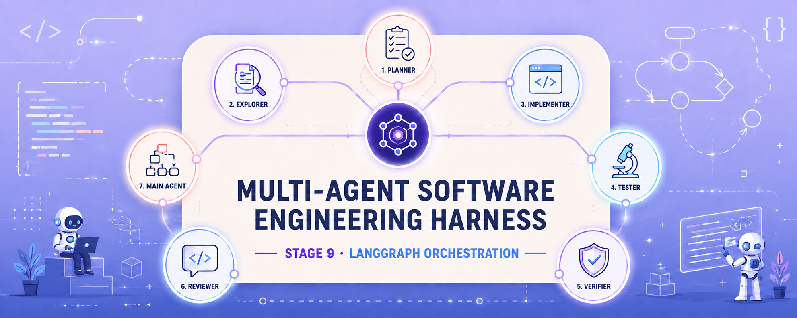
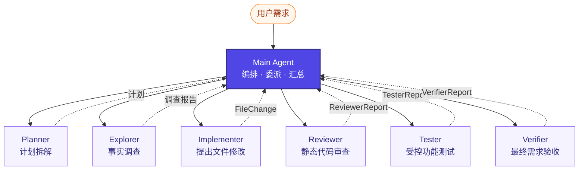
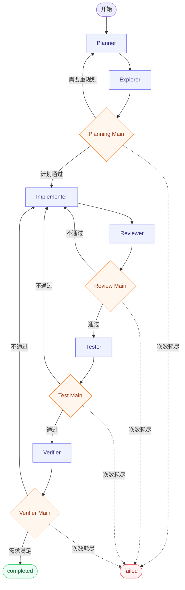
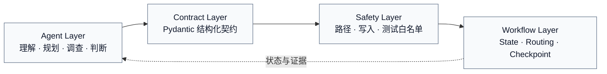

<div align="center">



# Stage 9 · Multi-Agent Software Engineering Harness

**基于 LangGraph 自主构建的 7-Agent 软件工程协作系统**

从需求规划、项目探索、代码实现，到审查、测试、验证与失败返工，形成一条可持久化、可恢复、受安全边界约束的软件开发闭环。

<p>
  
  
  
  
</p>

<p>
  
  
  
  
  
</p>

[项目概览](#overview) · [系统架构](#architecture) · [核心能力](#features) · [快速开始](#quick-start) · [质量保障](#quality-gates) · [验证结果](#verification) · [目录结构](#structure)

[返回 LangChain 学习项目](https://github.com/yuanimperialhal/Langchain_Learing)

</div>

> [!IMPORTANT]
> 本项目更准确的定位是 **Multi-Agent Workflow / Multi-Agent Orchestration**：由 Main Agent 与 Planner、Explorer、Implementer、Reviewer、Tester、Verifier 六个专业 Agent 组成 **7-Agent 协作架构**。它不是调用 DeepAgents `task` Tool 的 Subagent 机制，而是直接使用 LangGraph、State 与条件路由搭建的一套 Multi-Agent Harness。

<a id="overview"></a>

## 项目概览

单个 Agent 同时负责规划、调查、编码、审查和测试时，容易出现职责混乱、上下文污染与副作用失控。本项目将软件开发流程拆成七个职责独立的 Agent，并把关键控制权交给确定性的 Python 代码：

- **Agent 负责语义工作**：理解需求、制定计划、调查事实、生成修改和判断质量。
- **Pydantic 负责交接契约**：约束文件修改、审查结论、测试报告与最终验证。
- **Python 负责确定性控制**：执行路径检查、文件写入、白名单测试和条件路由。
- **LangGraph 负责流程编排**：管理状态、质量门、有限返工循环与最终出口。

### 为什么值得做

| 传统单 Agent 的问题 | 本项目的处理方式 |
| --- | --- |
| 一个 Prompt 包办所有职责 | 七个独立角色、独立 Prompt、独立输入边界 |
| 自然语言交接容易丢失事实 | `MultiAgentState` + Pydantic 结构化契约 |
| 模型直接写文件、执行命令风险高 | Writer 与 Runner 受 Python 安全层控制 |
| “看起来正确”就结束 | Reviewer → Tester → Verifier 三重质量门 |
| 失败后无限循环或无序重试 | 每类返工都有计数上限和明确失败出口 |
| 会话和项目之间互相污染 | `thread_id` 会话隔离 + `project_id` 项目隔离 |

### 当前完成度

```text
Stage 9       [■■■■■]  Core Multi-Agent Harness
Stage 9 Plus  [■■■■■]  Memory · Multi-project · ToolRegistry · Exa MCP
Status        completed
```

核心 Harness、连续聊天、SQLite Checkpoint、滚动摘要、多项目管理、本地 Tool 自动发现、中央 ToolRegistry、Exa 远程 MCP，以及按角色最小权限注入均已完成验收。

<a id="architecture"></a>

## 系统架构

### 7-Agent 职责拓扑



七个角色都拥有独立职责、Prompt 和执行逻辑。模型统一由 `llm.py` 创建，当前使用 `ChatTongyi(model="qwen-plus", temperature=0)`；角色之间不会隐式共享记忆，所需事实由 Graph State 显式传递。

### 实际工作流与返工闭环



后续任一质量门失败，都会回到 Implementer 修复，并从 Reviewer 开始重新通过后续质量门。这样可以避免新修复破坏已经审查或测试过的行为。

### 四层工程边界



<a id="features"></a>

## 核心能力

| 能力 | 实现 | 价值 |
| --- | --- | --- |
| 7-Agent 协作 | Main + 6 个专业 Agent | 职责分离，减少 Prompt 污染 |
| 有限规划循环 | Planner ↔ Explorer ↔ Planning Main | 计划基于项目事实迭代 |
| 三重质量门 | Reviewer → Tester → Verifier | 分别覆盖静态质量、真实测试和需求验收 |
| 结构化交接 | `FileChange`、`GateFinding`、三类 Report | 输出可校验，可作为路由依据 |
| 安全副作用 | 路径解析、受控 Writer、白名单 Runner | 模型提出建议，Python 决定是否执行 |
| 连续会话 | `thread_id` + SQLite Checkpoint | 重启后继续原任务，不同会话相互隔离 |
| 上下文压缩 | 滚动摘要 + 最近消息 + 结构化 State | 长会话不必反复携带全部原文 |
| 多项目管理 | `project_id` + 独立目录 + 进程锁 | 隔离源码、状态和报告，避免并发覆盖 |
| 可扩展工具平台 | 自动发现 + `ToolRegistry` | 新本地 Tool 无需修改 Agent 源码 |
| 远程研究能力 | Exa Streamable HTTP MCP | 白名单搜索与网页读取，外部内容按不可信数据处理 |
| 最小权限注入 | 按角色发放 Tool | 每个 Agent 只能获得完成职责所需的能力 |

### Agent 职责与边界

| 角色 | 核心职责 | 结构化输出 / 工具 | 明确边界 |
| --- | --- | --- | --- |
| Main Agent | 编排任务、整理委派信息、汇总最终结果 | 普通消息 | 不直接修改业务文件 |
| Planner | 将目标拆成可执行计划 | 普通消息；可使用受限研究工具 | 不写代码、不执行副作用 |
| Explorer | 根据项目快照与必要研究报告事实 | `ExplorerReport` | 不猜测快照之外的项目事实 |
| Implementer | 每轮提出一项完整文件修改 | `FileChange` | 不直接访问文件系统、不删除文件 |
| Reviewer | 基于最新源码进行静态审查 | `ReviewerReport` | 不修改文件、不伪称测试通过 |
| Tester | 选择并运行白名单测试，判断需求覆盖 | `TesterReport` | 不能运行任意 Shell 命令 |
| Verifier | 综合目标、源码与前两份报告最终验收 | `VerifierReport` | 不能跳过审查或脱离证据下结论 |

### Tool 最小权限矩阵

| 角色 | 本地只读 Tool | Exa Search | Exa Fetch | 提交契约 | 测试 Runner |
| --- | :---: | :---: | :---: | :---: | :---: |
| Main Agent | — | — | — | — | — |
| Planner | ✓ | ✓ | ✓ | — | — |
| Explorer | ✓ | ✓ | ✓ | `ExplorerReport` | — |
| Implementer | — | — | — | `FileChange` | — |
| Reviewer | ✓ | — | ✓ | `ReviewerReport` | — |
| Tester | — | — | — | `TesterReport` | ✓ |
| Verifier | ✓ | — | ✓ | `VerifierReport` | — |

Explorer 在需要外部研究时最多执行三次搜索或网页读取，随后必须提交一份结构化报告。网页内容始终视为不可信数据，不能借此绕过 Writer、Runner 或角色权限。

<a id="quick-start"></a>

## 快速开始

### 1. 安装依赖

```bash
cd hands_on/09_multi_agent_harness
uv sync
```

### 2. 配置环境变量

在当前目录创建仅供本地使用的 `.env`：

```dotenv
DASHSCOPE_API_KEY=your_dashscope_api_key
EXA_API_KEY=your_optional_exa_api_key
```

> [!CAUTION]
> `.env` 已被 `.gitignore` 忽略。不要把真实密钥写入 README、Python 文件、终端截图或 Git 历史。

`DASHSCOPE_API_KEY` 用于 Qwen 模型调用；`EXA_API_KEY` 可选，若设置，只会通过 `x-api-key` 请求头发送。当前工作流启动时需要能够连接 Exa MCP 以加载白名单工具。

### 3. 启动连续任务 CLI

```bash
uv run python chat_cli.py
```

程序会依次询问：

```text
请输入 project_id（直接回车使用 default-project）：
请输入 thread_id（直接回车使用 stage9-main-thread）：
请输入需求（输入 exit、quit 或退出,来结束程序）：
```

- 相同 `project_id + thread_id`：继续同一项目中的原会话。
- 更换 `thread_id`：创建互相隔离的新会话。
- 更换 `project_id`：切换源码目录、Checkpoint 和质量报告目录。
- 输入 `exit`、`quit`、`退出`，或使用 `Ctrl+C`：结束 CLI。

### 4. 读取历史存档

```bash
uv run python checkpoint_reader.py
```

存档读取器会显示阶段、状态、产物版本、返工次数、会话历史和滚动摘要。

<a id="quality-gates"></a>

## 质量保障

### 结构化交接契约

#### `FileChange`

Implementer 不能只返回“已经改好”，而要提交完整且可校验的修改：

| 字段 | 含义 |
| --- | --- |
| `relative_path` | 相对于当前项目沙箱的目标路径 |
| `operation` | 只允许 `create` 或 `replace` |
| `content` | 目标文件的完整内容 |
| `rationale` | 本轮修改理由 |

```text
Implementer 生成 Tool Call
→ Python 提取 AIMessage.tool_calls
→ Pydantic 构造 FileChange
→ Safety Layer 校验并执行写入
```

#### `GateFinding` 与质量报告

每个质量问题都必须包含类别、严重程度、问题说明、证据和修复建议。Pydantic 还会检查报告内部一致性：

```text
存在 blocking finding  → passed 不能为 true
passed 为 false         → 至少存在一个 blocking finding
report.revision          → 必须匹配最新 artifact_revision
```

### Python 受控写入

```text
FileChange
→ resolve_sandbox_path()
→ 拒绝绝对路径、盘符与 ../ 越界
→ 检查 create / replace 前置条件
→ 确认目标仍在项目沙箱
→ UTF-8 写入
```

已实现的安全规则：

- 拒绝绝对路径、带盘符路径和 `../` 路径逃逸。
- 拒绝将沙箱根目录本身作为目标文件。
- `create` 遇到已有目标时失败，防止静默覆盖。
- `replace` 要求目标必须是已存在文件。
- 不支持 `delete`；Pydantic 校验完成前不会产生写入。

### 白名单测试 Runner

Tester 只能选择预先登记的 `test_id`，不能拼接 Shell 命令。通用 Python 测试协议会：

1. 递归编译项目中的 `.py` 文件。
2. 从 `tests/test_*.py` 发现并执行 `unittest`。
3. 将真实退出码与输出交给 Tester 生成报告。

| 退出码 | 含义 |
| :---: | --- |
| `0` | 发现功能测试且全部通过 |
| `1` | 测试断言失败 |
| `2` | 没有发现功能测试，禁止“零测试通过” |
| `3` | Python 源码编译失败 |

Runner 使用 `shell=False`、固定工作目录和超时限制。命令成功只说明已执行的测试通过，Tester 仍需判断这些测试是否覆盖原始需求。

### 会话记忆与项目隔离

```text
完整历史 → SQLite Checkpoint（负责存档）
滚动摘要 + 最近消息 + 结构化 State → Agent 工作上下文

project_id
├── projects/<project_id>/             # 独立源码
└── data/projects/<project_id>/
    ├── checkpoint.db                  # 独立状态
    └── reports/<thread_id>/           # 独立质量报告
```

同一项目通过进程锁串行运行，避免两个任务同时覆盖产物。即使不同项目使用相同 `thread_id`，它们的源码、Checkpoint 和报告也不会串联。

<a id="verification"></a>

## 验证结果

### 自动化回归

```bash
uv run python -m unittest discover -s tests -p 'test_*.py'
```

| 验收项 | 结果 |
| --- | ---: |
| Stage 9 完整离线回归 | `73` 项，`OK (skipped=1)` |
| 真实 Exa MCP 集成测试 | `1 / 1` 通过 |
| 毕业项目功能测试 | `2 / 2` 通过 |
| 早期 Harness 稳定回归 | `10 / 10` 通过 |
| 待办与记账练习项目功能测试 | `32` 项通过 |

默认回归会跳过需要联网的真实 Exa 集成测试；显式联网验收使用：

```bash
RUN_EXA_INTEGRATION=1 uv run python -m unittest tests.test_exa_integration
```

### 已验证的动态返工路径

```text
plan_revision: 3
replan_count: 2
plan_approved: True
phase: completed
status: completed
next_role: None
review_repair_count: 0
tester_repair_count: 1
verifier_repair_count: 1
verifier_passed: True
```

该运行不是静态定义检查：自定义终端需求实际经历两次重新规划、一次 Tester 返工和一次 Verifier 返工，随后重新通过 Reviewer、Tester、Verifier 并收敛到 `completed`。

毕业项目 `stage9-exa-graduation` 复用相同 `project_id + thread_id=final` 保留失败现场并继续修复，最终得到 `phase=completed`、`checkpoint_status=completed` 与 `verifier_passed=True`。

<a id="structure"></a>

## 目录结构

```text
09_multi_agent_harness/
├── assets/
│   └── stage9-harness-hero.png     # README 横幅
├── agents/                         # 七个职责独立的 Agent
│   ├── main_agent/
│   ├── planner/
│   ├── explorer/
│   ├── implementer/
│   ├── reviewer/
│   ├── tester/
│   └── verifier/
├── capabilities/                   # 统一能力平台
│   ├── bootstrap.py                # 组装本地、Harness 与远程 Tool
│   ├── contracts.py                # Tool 注册契约与角色定义
│   ├── registry.py                 # 自动发现、注册与按角色发放
│   ├── local_tools/                # 项目内可扩展只读 Tool
│   └── remote_tools/exa/           # Exa MCP 配置、策略、客户端和桥接
├── contracts/                      # Pydantic 结构化交接契约
├── safety/                         # 路径、写入和白名单测试边界
├── workflow/
│   ├── state.py                    # MultiAgentState
│   ├── graph.py                    # StateGraph、条件边和循环出口
│   ├── nodes.py                    # Node 构造与依赖注入
│   └── node_handlers/              # 各角色 Node 实现
├── tests/                          # Harness 自动化回归测试
├── practice_sandbox/
│   ├── projects/<project_id>/      # 项目隔离源码目录
│   └── data/projects/<project_id>/ # Checkpoint 与质量报告
├── chat_cli.py                     # 连续任务入口
├── checkpoint_reader.py            # 会话存档读取器
├── langgraph_main.py               # 项目级 Graph 运行入口
├── project_manager.py              # 项目解析、ID 校验和进程锁
├── report_store.py                 # 三份质量报告持久化
├── llm.py                          # qwen-plus 模型工厂
├── pyproject.toml
└── uv.lock
```

<details>
<summary><strong>查看 State、上下文和报告的交接方式</strong></summary>

### Graph State

`MultiAgentState` 保存：

- 阶段：`planning`、`exploring`、`implementing`、`reviewing`、`testing`、`verifying`、`completed`、`failed`。
- 角色：Main、Planner、Explorer、Implementer、Reviewer、Tester、Verifier。
- 产物：`artifact_revision`、`changed_files`、`pending_file_changes`。
- 报告：Explorer、Reviewer、Tester、Verifier 的当前结构化报告。
- 计数：规划、审查、测试与验证的返工次数及各自上限。

### 显式上下文交接

```text
原始用户任务
＋ Planner 计划
＋ Explorer 调查报告
＋ 本轮 FileChange
＋ 写入后的最新源码快照
＋ 当前 artifact_revision
＋ 已通过的质量报告
→ 组装下一角色所需的最小上下文
```

### `AIMessage` 与 `ToolMessage`

- Implementer 在 `AIMessage.tool_calls` 中提出 `submit_file_change` 参数，Python 据此构造 `FileChange`。
- 质量报告 Tool 执行后产生 `ToolMessage`，Python 从成功的 `artifact` 中构造对应 Report。

二者不能混用：Tool Call 表示模型请求调用工具，Tool Message 表示工具已经执行并返回结果。

</details>

<details>
<summary><strong>查看 ToolRegistry 与 Exa MCP 设计</strong></summary>

本地 Tool 模块通过 `TOOL_REGISTRATIONS` 声明真实 `BaseTool`、来源、允许角色和超时。程序启动时扫描可信的 `capabilities/local_tools/*.py`；增加符合契约的新文件并重启，即可进入注册表，不需要修改各 Agent。

Exa 使用远程 Streamable HTTP MCP，只允许加载：

```text
web_search_exa  → 搜索互联网
web_fetch_exa   → 读取指定网页正文
```

远程异步 Tool 由 `bridge.py` 包装为同步 Graph 可调用的 Tool，并受到参数校验、超时与返回长度限制。注册表拒绝重名、空角色、非法超时和非白名单远程 Tool。

</details>

## 当前边界与下一阶段

Stage 9 与 Stage 9 Plus 已完成。当前仍保留两项明确边界：

- 项目级 RAG 作为后续增强，不阻塞当前阶段完成。
- SQLite Checkpoint 对自定义 Pydantic 报告可能提示严格 msgpack 白名单警告；当前不影响验收，后续可通过保存普通字典或注册允许类型解决。

第十阶段将继续进入 **FastAPI、异步并发、多用户状态生命周期、Docker 与云部署**，把当前 Harness 从本地工程原型推进到生产级服务。

## 核心收获

- Multi-Agent 的价值不在 Agent 数量，而在职责边界、可验证交接与失败恢复。
- Main Agent 负责编排，不应亲自包办所有专业工作。
- 会驱动副作用和路由的输出应结构化，不能只依赖自然语言。
- 模型负责语义判断，Python 负责路径、写入、命令和状态迁移。
- Reviewer 通过不能代替真实测试；测试通过也不能代替最终需求核验。
- 每个质量循环都必须有最大次数和明确出口。
- 外部网页属于不可信输入，联网能力不能扩大 Agent 的文件与命令权限。

---

<div align="center">

**Stage 9 completed · Built from scratch with LangGraph**

</div>
